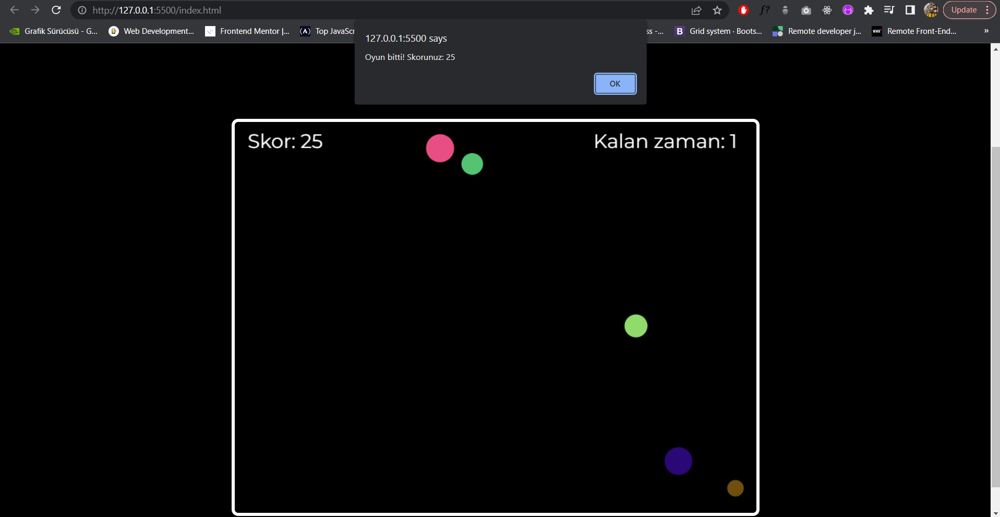

# Balonları Patlatma Oyunu

Bu proje, HTML, CSS ve JavaScript kullanılarak basit bir balon patlatma oyunudur. Oyuncuların, verilen süre içinde mümkün olan en yüksek skoru elde etmeleri amaçlanmaktadır.

## Proje Tanıtım Videosu
Projemi tanıttığım videoya aşağıdaki linkten ulaşabilirsiniz!

https://youtu.be/az_F5br4b8Q

## Nasıl Oynanır
* https://definetelynotarobot.github.io/Balonlari-Patlatma-Oyunu/ linkinden oyuna erişim sağlayabilirsiniz.
* Oyuncular, balonları patlatmak için farelerinin sol tık butonunu kullanmalıdır.
* Patlatılan her balon için, oyunculara bir puan verilir.
* Oyun 30 saniye sürer.
* Oyunun sonunda, oyuncuların aldıkları puanlar ekranda gösterilir.
* Oyunu tekrar oynamak için sayfandaki "Tekrar Oyna" butonunu kullanabilirsiniz.

## Oynanış Ekran Görüntüleri
Sayfamıza giriş yaptığımızda karşımıza oyunun nasıl oynanacağını tek bir cümleyle anlatan bir paragraf çıkıyor ve oyunumuz başlamış oluyor.

Bize verilen zaman dahilinde elimizden geldiği kadar balonu patlıyoruz ve zaman bittiğinde skorumuz bize bir alert olarak geliyor.

Tekrardan oynamak istersek "Tekrar Oyna" butonundan oyunumuzu tekrardan başlatabiliriz.

## Nasıl Kurabilirim

* Proje dosyalarını indirin veya kopyalayın.
* Dosyaları bir klasöre çıkartın.
* index.html dosyasını açın.

## Kullanılan Teknolojiler

* HTML
* CSS
* Vanilla JavaScript

